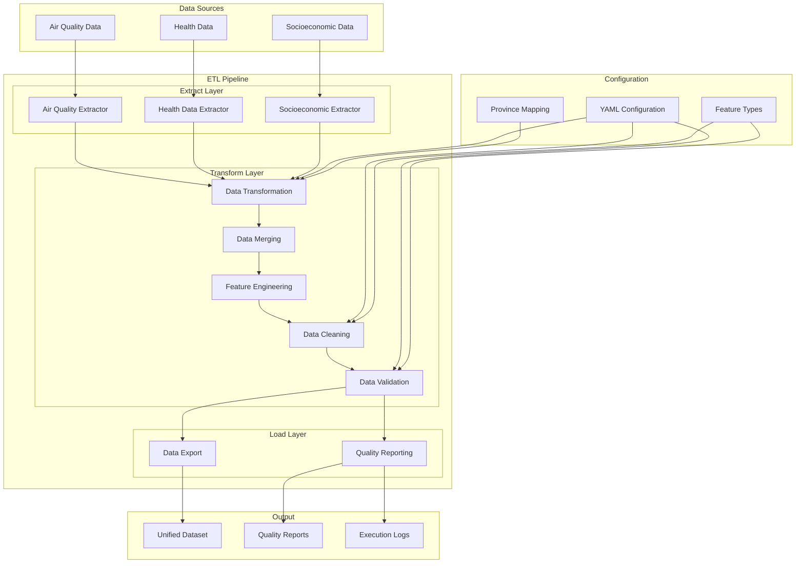
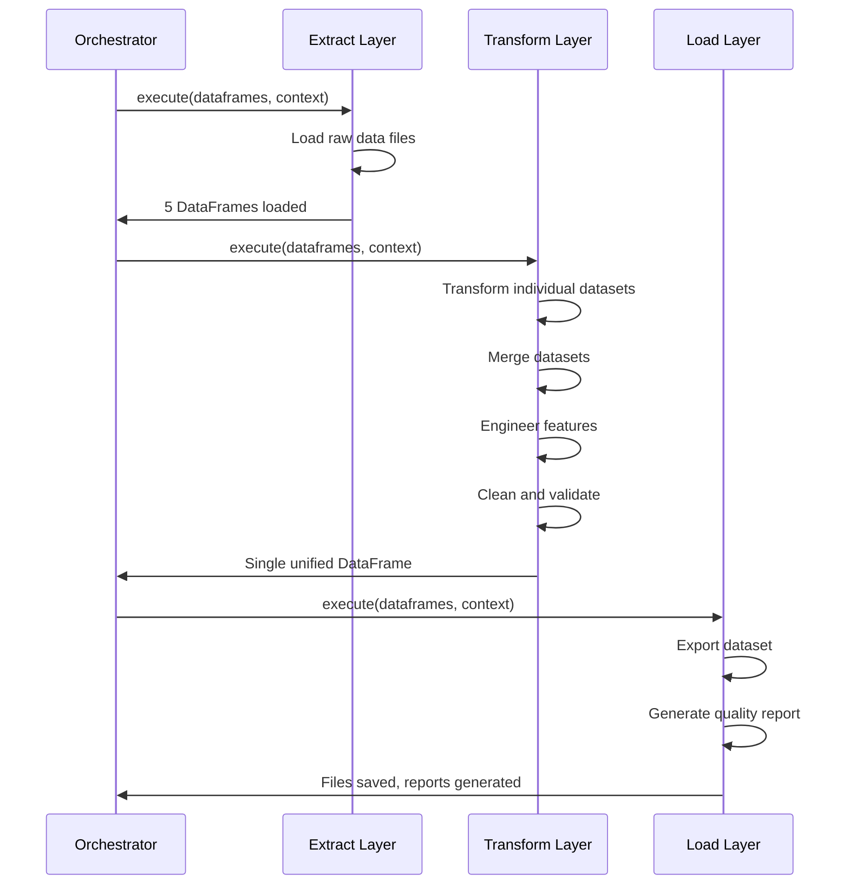
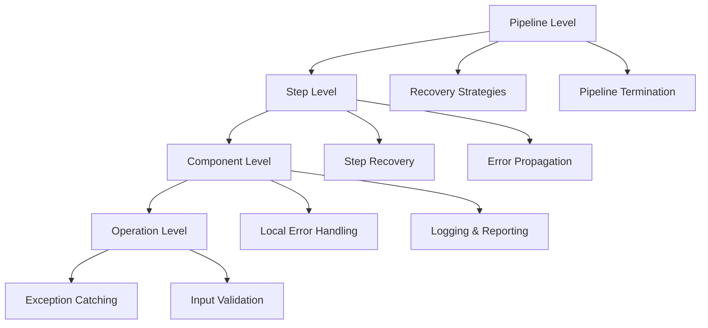

# Architecture Overview

The ETL Pipeline follows a modular, layered architecture designed for maintainability, extensibility, and robustness. This document provides a comprehensive overview of the system's architectural principles and design patterns.

## System Architecture

### High-Level Architecture



### Architectural Principles

#### 1. Separation of Concerns
Each layer has a distinct responsibility:
- **Extract**: Data acquisition and initial validation
- **Transform**: Data processing, cleaning, and integration
- **Load**: Data persistence and reporting

#### 2. Modularity
Components are loosely coupled and highly cohesive:
- Independent data extractors for each source
- Specialized transformers for domain-specific logic
- Configurable pipeline steps

#### 3. Extensibility
New functionality can be added without modifying existing code:
- Abstract base classes define extension points
- Configuration-driven behavior
- Plugin-style architecture for new data sources

#### 4. Robustness
The system handles errors gracefully:
- Comprehensive error handling and logging
- Recovery mechanisms for common failures
- Data validation at multiple stages

## Core Components

### 1. Main Orchestrator

**File**: `src/etl_pipeline/main_orchestrator.py`

The `ETLPipeline` class serves as the central coordinator:

```python
class ETLPipeline:
    def __init__(self, steps: Optional[List[ETLStep]] = None):
        self.steps = steps or self._get_default_steps()
        self.recovery_enabled = True
    
    def run(self) -> Tuple[pd.DataFrame, Dict[str, Any]]:
        # Execute all pipeline steps sequentially
        # Handle errors and recovery
        # Return results and metadata
```

**Key Responsibilities**:
- Step orchestration and execution order
- Error handling and recovery coordination
- Context management across pipeline steps
- Performance monitoring and reporting

### 2. Base Classes

#### ETLStep Base Class

```python
class ETLStep(ABC):
    def __init__(self, name: str):
        self.name = name
        self.logger = logging.getLogger(self.__class__.__name__)
    
    @abstractmethod
    def execute(self, dataframes: Dict[str, pd.DataFrame], context: Dict[str, Any]) -> None:
        pass
```

**Design Benefits**:
- Consistent interface across all pipeline steps
- Built-in logging capabilities
- Standardized error handling patterns
- Easy testing and mocking

#### BaseExtractor Pattern

```python
class BaseExtractor(ABC):
    def __init__(self, name: str, data_path: Path):
        self.name = name
        self.data_path = data_path
        self.logger = logging.getLogger(self.__class__.__name__)
    
    @abstractmethod
    def extract(self, dataframes: Dict[str, pd.DataFrame], format: str = "") -> None:
        pass
    
    def _log_dataframe_info(self, df: pd.DataFrame) -> None:
        # Common DataFrame logging utilities
```

**Design Benefits**:
- Reusable data quality logging
- Consistent file path handling
- Standardized error reporting
- Common DataFrame validation patterns

### 3. Configuration Management

#### ConfigManager Class

```python
class ConfigManager:
    def __init__(self, env: str = "", config_path: Optional[Path] = None):
        self.env = env or os.getenv("ETL_ENV", "development")
        self.config = self._load_config()
    
    def get(self, key_path: str, default: Any = None) -> Any:
        # Dot-notation access to nested configuration
    
    def validate_config(self) -> None:
        # Comprehensive configuration validation
```

**Configuration Hierarchy**:
1. **Base Configuration**: `pipeline_config.yaml`
2. **Environment Overrides**: `pipeline_config_{env}.yaml`
3. **Runtime Parameters**: Command-line arguments or environment variables

## Data Flow Architecture

### 1. Execution Context

The pipeline maintains a shared execution context that flows through all steps:

```python
context = {
    "data_path": Path,           # Base data directory
    "export_format": List[str],  # Output formats
    "output_file_path": str,     # Final dataset path
    "reports_path": str,         # Quality reports path
    "validation_summary": Dict,  # Validation results
}
```

### 2. DataFrame Dictionary

All pipeline steps operate on a shared DataFrame dictionary:

```python
dataframes = {
    # Extraction outputs
    "air_quality": pd.DataFrame,
    "respiratory_diseases": pd.DataFrame,
    "life_expectancy": pd.DataFrame,
    "gdp": pd.DataFrame,
    "province_population": pd.DataFrame,
    
    # Intermediate results
    "merged_data": pd.DataFrame,
    
    # Final output
    "output_df": pd.DataFrame
}
```

### 3. Processing Pipeline



## Design Patterns

### 1. Template Method Pattern

The ETL pipeline implements the Template Method pattern:

```python
class ETLPipeline:
    def run(self):
        # Template method defining the algorithm structure
        for step in self.steps:
            self._execute_step(step)  # Hook method
            self._handle_errors(step)  # Hook method
        return self._generate_results()  # Hook method
```

### 2. Strategy Pattern

Different data sources use different extraction strategies:

```python
# Air quality strategy
class AirQualityDataExtractor(BaseExtractor):
    def extract(self, dataframes, format=""):
        # Air quality specific extraction logic
        
# Health data strategy  
class HealthDataExtractor(BaseExtractor):
    def extract(self, dataframes, format=""):
        # Health data specific extraction logic
```

### 3. Chain of Responsibility Pattern

Pipeline steps form a processing chain:

```python
steps = [
    DataExtractionStep(),      # Handler 1
    DataTransformationStep(),  # Handler 2
    DataMergingStep(),         # Handler 3
    # ... additional handlers
]
```

Each step:
- Processes the request (operates on data)
- Passes control to the next step
- Can modify the shared context

### 4. Observer Pattern

Logging system observes pipeline execution:

```python
class ETLStep:
    def execute(self, dataframes, context):
        self.log_start()  # Notify observers
        # Perform work
        self.log_success()  # Notify observers
```

## Error Handling Architecture

### 1. Layered Error Handling



### 2. Recovery Mechanisms

The pipeline implements several recovery strategies:

```python
def _attempt_step_recovery(self, step, dataframes, context, error):
    if step_name == "DataValidationStep":
        # Continue with warnings for validation issues
        if "validation passed with" in error_message:
            return
    elif step_name == "DataCleaningStep":
        # Retry with relaxed parameters
        step.relaxed_mode = True
        step.execute(dataframes, context)
```

## Performance Architecture

### 1. Memory Management

- **Lazy Loading**: Data loaded only when needed
- **Memory Monitoring**: Track DataFrame memory usage
- **Garbage Collection**: Explicit cleanup of intermediate results

### 2. Processing Optimization

- **Selective Column Loading**: Load only required columns
- **Early Type Conversion**: Apply data types early to save memory
- **Incremental Processing**: Process data in manageable chunks

### 3. Caching Strategy

- **Configuration Caching**: Load and validate configuration once
- **Province Mapping Cache**: Cache standardized province names
- **Intermediate Results**: Optionally cache transformation results

## Scalability Considerations

### 1. Horizontal Scaling

The architecture supports horizontal scaling through:

- **Data Partitioning**: Process data by time ranges or regions
- **Parallel Processing**: Independent extraction of data sources
- **Distributed Computing**: Framework-agnostic design allows integration with Spark/Dask

### 2. Vertical Scaling

Memory and CPU optimization strategies:

- **Streaming Processing**: Process large files in chunks
- **Memory-Efficient Algorithms**: Use pandas operations optimized for memory
- **CPU Optimization**: Vectorized operations where possible

## Integration Points

### 1. Machine Learning Pipeline

The ETL pipeline integrates with the ML pipeline through:

- **Standardized Output Format**: CSV with defined schema
- **Feature Type Definitions**: JSON configuration for ML pipeline
- **Data Validation**: Ensures ML pipeline receives clean data

### 2. Web Application

Integration with the web application:

- **Shared Data Directory**: Common data storage location
- **Configuration Sharing**: Shared configuration files
- **Model Serving**: Processed data feeds model training

### 3. External Systems

Extension points for external integration:

- **Custom Extractors**: Plugin architecture for new data sources
- **Export Formats**: Configurable output formats (CSV, Parquet, JSON)
- **Notification Systems**: Hooks for external monitoring systems

This architecture provides a solid foundation for reliable, maintainable, and extensible data processing while supporting the specific requirements of air quality and health outcome analysis.