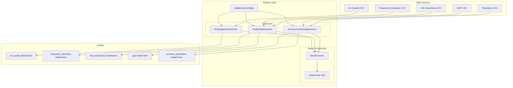

# Extract Layer Documentation

The Extract Layer is responsible for acquiring data from various sources and preparing it for transformation. This layer implements a modular architecture with specialized extractors for each data source.

## Architecture Overview



## Core Components

### DataExtractionStep

**File**: `src/etl_pipeline/extract/data_extraction_step.py`

The main orchestrator for the extraction phase.

#### Responsibilities

- Coordinates execution of all data extractors
- Validates execution context and data paths
- Aggregates extraction results
- Provides progress logging and error handling

#### Implementation

```python
class DataExtractionStep(ETLStep):
    def execute(self, dataframes: Dict[str, pd.DataFrame], context: Dict[str, Any]) -> None:
        # Validate context
        data_path = context.get("data_path")
        
        # Execute extractors in sequence
        air_quality_extractor = AirQualityDataExtractor("air_quality", data_path)
        health_extractor = HealthDataExtractor("health", data_path)
        socioeconomic_extractor = SocioeconomicDataExtractor("socioeconomic", data_path)
        
        # Extract data
        air_quality_extractor.extract(dataframes)
        health_extractor.extract(dataframes)
        socioeconomic_extractor.extract(dataframes)
```

#### Output

The step populates the dataframes dictionary with 5 DataFrames:

| Key | Description | Source File |
|-----|-------------|-------------|
| `air_quality` | Air quality monitoring data | `air_quality_with_province.csv` |
| `respiratory_diseases` | Respiratory disease statistics | `enfermedades_respiratorias.csv` |
| `life_expectancy` | Life expectancy data | `esperanza_vida.csv` |
| `gdp` | GDP per capita data | `PIB per cap provincias 2000-2021.csv` |
| `province_population` | Population data | `poblacion_provincias.csv` |

### BaseExtractor

**File**: `src/etl_pipeline/extract/data_extractors/base_extractor.py`

Abstract base class providing common functionality for all data extractors.

#### Key Features

```python
class BaseExtractor(ABC):
    def __init__(self, name: str, data_path: Path):
        self.name = name
        self.data_path = data_path
        self.logger = logging.getLogger(self.__class__.__name__)
    
    @abstractmethod
    def extract(self, dataframes: Dict[str, pd.DataFrame], format: str = "") -> None:
        pass
    
    def _log_dataframe_info(self, df: pd.DataFrame) -> None:
        # Comprehensive DataFrame logging
```

#### DataFrame Logging Utilities

The base extractor provides comprehensive logging for data quality assessment:

- **Null Values**: Count and percentage of missing values per column
- **Duplicate Rows**: Number of duplicate records
- **Empty Rows**: Rows with >70% missing values
- **Memory Usage**: DataFrame memory consumption in MB
- **Data Types**: Column data types and basic statistics

## Specialized Extractors

### AirQualityDataExtractor

**File**: `src/etl_pipeline/extract/data_extractors/air_quality_data_extractor.py`

#### Purpose
Extracts air quality monitoring data from Spanish monitoring stations.

#### Data Source
- **File**: `air_quality_data/raw/air_quality_with_province.csv`
- **Format**: Standard CSV with comma separators
- **Encoding**: UTF-8
- **Size**: Typically 500K+ records

#### Column Selection
Only loads 12 essential columns to optimize memory usage:

```python
COLUMNS_TO_USE = [
    "Air Pollutant",
    "Air Pollutant Description", 
    "Data Aggregation Process",
    "Year",
    "Air Pollution Level",
    "Unit Of Air Pollution Level",
    "Air Quality Station Type",
    "Air Quality Station Area",
    "Altitude",
    "Longitude",
    "Latitude",
    "Province"
]
```

#### Processing Features

1. **Selective Loading**: Only required columns loaded to reduce memory
2. **Date Parsing**: Automatic parsing of "Year" column as datetime
3. **Data Validation**: Checks for empty DataFrames and file accessibility
4. **Error Handling**: Comprehensive error messages for common issues

#### Implementation Details

```python
def extract(self, dataframes: Dict[str, pd.DataFrame], format: str = "") -> None:
    file_path = self.data_path / "air_quality_data" / "raw" / "air_quality_with_province.csv"
    
    try:
        df = pd.read_csv(
            file_path,
            usecols=self.COLUMNS_TO_USE,
            parse_dates=["Year"]
        )
        
        if df.empty:
            raise ValueError("Air quality DataFrame is empty")
            
        dataframes["air_quality"] = df
        self._log_dataframe_info(df)
        
    except FileNotFoundError:
        raise FileNotFoundError(f"Air quality data file not found: {file_path}")
```

### HealthDataExtractor

**File**: `src/etl_pipeline/extract/data_extractors/health_data_extractor.py`

#### Purpose
Extracts health outcome data including respiratory diseases and life expectancy statistics.

#### Data Sources

**Respiratory Diseases**:
- **File**: `health_data/raw/enfermedades_respiratorias.csv`
- **Format**: Spanish CSV (semicolon separators, comma decimals)
- **Encoding**: UTF-8
- **Content**: Provincial respiratory disease mortality rates

**Life Expectancy**:
- **File**: `health_data/raw/esperanza_vida.csv`
- **Format**: Spanish CSV (semicolon separators, comma decimals)
- **Encoding**: Latin1 (handles Spanish characters)
- **Content**: Provincial life expectancy statistics

#### Processing Features

1. **Dual Dataset Processing**: Handles two related datasets in one operation
2. **Spanish CSV Format**: Handles semicolon separators and comma decimal points
3. **Multiple Encodings**: Supports different encodings for each file
4. **Date Parsing**: Parses "Periodo" column as datetime for temporal analysis
5. **Data Type Optimization**: Predefined data types for memory efficiency

#### Implementation Details

```python
def extract(self, dataframes: Dict[str, pd.DataFrame], format: str = "") -> None:
    # Respiratory diseases extraction
    respiratory_file = self.data_path / "health_data" / "raw" / "enfermedades_respiratorias.csv"
    respiratory_df = pd.read_csv(
        respiratory_file,
        sep=";",
        decimal=",",
        parse_dates=["Periodo"],
        dtype=self.RESPIRATORY_DTYPES
    )
    
    # Life expectancy extraction  
    life_expectancy_file = self.data_path / "health_data" / "raw" / "esperanza_vida.csv"
    life_expectancy_df = pd.read_csv(
        life_expectancy_file,
        sep=";",
        decimal=",",
        encoding="latin1",
        parse_dates=["Periodo"],
        dtype=self.LIFE_EXPECTANCY_DTYPES
    )
    
    # Store in dataframes dictionary
    dataframes["respiratory_diseases"] = respiratory_df
    dataframes["life_expectancy"] = life_expectancy_df
```

#### Data Types Configuration

```python
RESPIRATORY_DTYPES = {
    "Provincias": "category",
    "Sexo": "category", 
    "Total": "float64"
}

LIFE_EXPECTANCY_DTYPES = {
    "Provincias": "category",
    "Sexo": "category",
    "Total": "float64"
}
```

### SocioeconomicDataExtractor

**File**: `src/etl_pipeline/extract/data_extractors/socioeconomic_data_extractor.py`

#### Purpose
Extracts economic and demographic data at provincial level.

#### Data Sources

**GDP per Capita**:
- **File**: `socioeconomic_data/raw/PIB per cap provincias 2000-2021.csv`
- **Format**: Spanish CSV with ISO-8859-1 encoding
- **Content**: Provincial GDP per capita data (2000-2021)
- **Structure**: Wide format with years as columns

**Population Data**:
- **File**: `socioeconomic_data/raw/poblacion_provincias.csv`
- **Format**: Spanish CSV with Latin1 encoding
- **Content**: Provincial population statistics
- **Structure**: Long format with temporal data

#### Processing Features

1. **Multiple Encodings**: Handles ISO-8859-1 and Latin1 encodings
2. **Format Flexibility**: Processes both wide and long format data
3. **Robust File Validation**: Checks file existence before processing
4. **Error Recovery**: Detailed error messages for troubleshooting

#### Implementation Details

```python
def extract(self, dataframes: Dict[str, pd.DataFrame], format: str = "") -> None:
    # GDP data extraction
    gdp_file = self.data_path / "socioeconomic_data" / "raw" / "PIB per cap provincias 2000-2021.csv"
    if gdp_file.exists():
        gdp_df = pd.read_csv(
            gdp_file,
            sep=";",
            decimal=",",
            encoding="ISO-8859-1"
        )
        dataframes["gdp"] = gdp_df
        self._log_dataframe_info(gdp_df)
    
    # Population data extraction
    population_file = self.data_path / "socioeconomic_data" / "raw" / "poblacion_provincias.csv"
    if population_file.exists():
        population_df = pd.read_csv(
            population_file,
            sep=";",
            decimal=",", 
            encoding="latin1",
            parse_dates=["Periodo"]
        )
        dataframes["province_population"] = population_df
        self._log_dataframe_info(population_df)
```

## Data Quality Monitoring

### Logging Framework

Each extractor provides comprehensive data quality logging:

```python
def _log_dataframe_info(self, df: pd.DataFrame) -> None:
    """Log comprehensive DataFrame information"""
    
    # Basic structure
    self.logger.info(f"DataFrame shape: {df.shape}")
    self.logger.info(f"Memory usage: {df.memory_usage(deep=True).sum() / 1024**2:.2f} MB")
    
    # Data quality metrics
    null_counts = df.isnull().sum()
    if null_counts.any():
        self.logger.warning(f"Null values found: {null_counts[null_counts > 0].to_dict()}")
    
    duplicate_count = df.duplicated().sum()
    if duplicate_count > 0:
        self.logger.warning(f"Duplicate rows: {duplicate_count}")
    
    # Empty rows (>70% null values)
    empty_rows = (df.isnull().sum(axis=1) / len(df.columns)) > 0.7
    if empty_rows.any():
        self.logger.warning(f"Empty rows (>70% null): {empty_rows.sum()}")
```

### Error Handling Patterns

Standard error handling across all extractors:

```python
try:
    # Data extraction logic
    df = pd.read_csv(file_path, **params)
    
    if df.empty:
        raise ValueError(f"{self.name} DataFrame is empty")
        
    dataframes[key] = df
    self._log_dataframe_info(df)
    
except FileNotFoundError as e:
    self.logger.error(f"Data file not found: {file_path}")
    raise FileNotFoundError(f"{self.name} data file not found: {file_path}")
    
except Exception as e:
    self.logger.error(f"Failed to extract {self.name} data: {str(e)}")
    raise RuntimeError(f"Failed to extract {self.name} data: {str(e)}")
```

## Configuration Integration

### File Path Configuration

Extractors use configuration for flexible file path management:

```yaml
# pipeline_config.yaml
data_sources:
  air_quality:
    directory: "air_quality_data"
    raw_file: "air_quality_with_province.csv"
    columns_to_use: [...]
  
  health:
    directory: "health_data"
    respiratory_diseases_file: "enfermedades_respiratorias.csv"
    life_expectancy_file: "esperanza_vida.csv"
```

### Processing Parameters

Configuration controls extraction behavior:

```yaml
processing:
  air_quality:
    invalid_province_values:
      - "nan"
      - "Desconocido" 
      - "Error"
```

## Performance Considerations

### Memory Optimization

1. **Selective Column Loading**: Only load required columns
2. **Data Type Specification**: Use appropriate data types to minimize memory
3. **Streaming for Large Files**: Consider chunked reading for very large datasets

### Processing Efficiency

1. **Parallel Extraction**: Independent extractors can run in parallel
2. **Caching**: File existence checks to avoid unnecessary operations
3. **Early Validation**: Validate data structure immediately after loading

## Error Recovery

### Common Issues and Solutions

**File Not Found**:
- Clear error messages with full file paths
- Suggestions for data directory setup
- Verification of project structure

**Encoding Issues**:
- Multiple encoding attempts (UTF-8, Latin1, ISO-8859-1)
- Specific encoding configuration per data source
- Fallback strategies for character encoding problems

**Data Format Issues**:
- Validation of expected column names
- Flexible parsing parameters (separators, decimals)
- Clear error messages for format mismatches

## Testing Strategy

### Unit Tests

Each extractor has comprehensive unit tests:

```python
def test_air_quality_extractor_success():
    # Test successful extraction
    
def test_air_quality_extractor_file_not_found():
    # Test file not found handling
    
def test_air_quality_extractor_empty_dataframe():
    # Test empty DataFrame handling
```

### Integration Tests

End-to-end testing with real data files:

```python
def test_extraction_step_complete_flow():
    # Test complete extraction step with all extractors
```

## Extension Points

### Adding New Data Sources

To add a new data source:

1. **Create New Extractor**: Inherit from `BaseExtractor`
2. **Implement Extract Method**: Define specific extraction logic
3. **Update Configuration**: Add data source configuration
4. **Update Orchestrator**: Register new extractor in `DataExtractionStep`
5. **Add Tests**: Create comprehensive test suite

Example:

```python
class WeatherDataExtractor(BaseExtractor):
    def extract(self, dataframes: Dict[str, pd.DataFrame], format: str = "") -> None:
        # Weather data specific extraction logic
        pass
```

### Custom File Formats

Support for new file formats:

1. **Extend BaseExtractor**: Add format-specific methods
2. **Configuration Support**: Add format parameters to configuration
3. **Error Handling**: Implement format-specific error handling

The Extract Layer provides a robust, extensible foundation for data acquisition with comprehensive error handling, quality monitoring, and performance optimization.