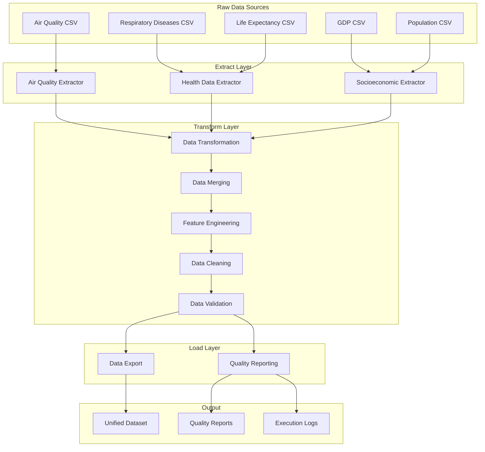

# ETL Pipeline Overview

The ETL (Extract, Transform, Load) Pipeline is a core component of the Air Quality Analysis Platform, responsible for processing raw data from multiple heterogeneous sources into a unified, analysis-ready dataset. This module serves as the foundation for all downstream analysis and machine learning workflows.

## Purpose and Scope

The ETL Pipeline addresses the challenge of integrating diverse data sources with different formats, structures, and quality characteristics into a coherent analytical dataset. It handles:

- **Data Acquisition**: Automated extraction from multiple CSV data sources
- **Data Integration**: Standardization and merging of heterogeneous datasets
- **Quality Assurance**: Comprehensive validation and quality reporting
- **Error Handling**: Robust error recovery and detailed logging

## Data Sources Processed

The pipeline integrates three primary data domains spanning 2000-2021:

### Air Quality Data
- **Source**: Spanish air quality monitoring stations
- **Content**: Pollutant measurements (SO2, PM2.5, PM10, O3, NO2)
- **Volume**: 500K+ measurement records
- **Complexity**: Multiple measurement types, station metadata, geographic coordinates

### Health Data  
- **Source**: Spanish National Institute of Statistics (INE)
- **Content**: Respiratory disease mortality, life expectancy statistics
- **Scope**: Provincial-level health outcomes
- **Format**: Spanish CSV format with specialized encodings

### Socioeconomic Data
- **Source**: Spanish National Institute of Statistics (INE)  
- **Content**: GDP per capita, population demographics
- **Scope**: Provincial economic and demographic indicators
- **Format**: Mixed wide/long format structures requiring transformation

## Pipeline Architecture



## Key Features

### Modular Design
- **Separation of Concerns**: Distinct layers for extraction, transformation, and loading
- **Extensibility**: Easy addition of new data sources or processing steps
- **Maintainability**: Clean interfaces and well-defined responsibilities

### Data Quality Focus
- **Multi-Layer Validation**: Validation at extraction, transformation, and final output stages
- **Quality Metrics**: Comprehensive reporting of data quality indicators
- **Error Detection**: Identification of outliers, missing values, and inconsistencies

### Robust Error Handling
- **Recovery Mechanisms**: Built-in strategies for common data quality issues
- **Graceful Degradation**: Continues processing when possible, logs issues clearly
- **Detailed Logging**: Comprehensive audit trail of all processing steps

### Configuration-Driven
- **YAML Configuration**: Flexible configuration management with environment overrides
- **Parameterizable**: Adjustable thresholds, time ranges, and processing options
- **Environment Support**: Development, testing, and production configurations

## Processing Workflow

### 1. Data Extraction
- **File Discovery**: Automatic detection and validation of source files
- **Format Handling**: Support for multiple CSV formats and encodings
- **Initial Validation**: Basic structure and content validation
- **Memory Optimization**: Selective column loading and efficient data types

### 2. Data Transformation
- **Domain-Specific Processing**: Specialized transformers for each data source
- **Standardization**: Province name normalization and data format consistency
- **Air Quality Classification**: Application of WHO/EU air quality thresholds
- **Data Type Optimization**: Conversion to appropriate data types for analysis

### 3. Data Integration
- **Key-Based Merging**: Integration using Province + Year as common keys
- **Missing Value Handling**: Strategies for incomplete data across sources  
- **Temporal Alignment**: Ensuring consistent time periods across datasets
- **Duplicate Resolution**: Detection and handling of duplicate records

### 4. Feature Engineering
- **Derived Metrics**: Creation of analytical features (e.g., deaths per 100k population)
- **Aggregations**: Summary statistics and derived indicators
- **Domain Knowledge**: Application of environmental health domain expertise

### 5. Data Quality Assurance
- **Statistical Validation**: Outlier detection using IQR methods
- **Business Rule Validation**: Domain-specific constraints and thresholds
- **Completeness Checks**: Missing data analysis and reporting
- **Consistency Validation**: Cross-field validation and logical constraints

### 6. Output Generation
- **Dataset Export**: Clean, integrated dataset in multiple formats (CSV, Parquet)
- **Quality Reports**: Comprehensive JSON reports with quality metrics
- **Execution Logs**: Detailed processing logs for debugging and auditing

## Configuration Management

The pipeline uses a hierarchical configuration system:

```yaml
# Base configuration (pipeline_config.yaml)
data_sources:
  air_quality:
    directory: "air_quality_data"
    raw_file: "air_quality_with_province.csv"
    
processing:
  time_range:
    start_year: 2000
    end_year: 2021
  data_quality:
    null_threshold_percent: 5.0
    
output:
  formats: ["csv"]
  filename: "dataset.csv"
```

Configuration supports:
- **Environment Overrides**: Separate configs for development/production
- **Data Source Specification**: File paths, column mappings, processing parameters
- **Quality Thresholds**: Configurable validation rules and error tolerances
- **Output Options**: Multiple export formats and destinations

## Performance Characteristics

### Processing Efficiency
- **Typical Runtime**: 2-5 minutes for complete pipeline execution
- **Memory Usage**: Optimized for datasets up to 20K rows with 20+ columns
- **Scalability**: Designed for provincial-level analysis (50+ provinces × 22 years)

### Resource Requirements
- **Minimum RAM**: 4GB (8GB recommended)
- **Storage**: 2GB for data, logs, and intermediate files
- **CPU**: Single-threaded design suitable for standard desktop/server hardware

## Integration Points

### Upstream Dependencies
- **Raw Data Files**: CSV files in specified directory structure
- **Configuration Files**: YAML configuration and feature type definitions
- **Province Mapping**: Standardized province name mapping file

### Downstream Consumers
- **ML Pipeline**: Uses the unified dataset for model training
- **Web Application**: Accesses processed data for visualization
- **Analysis Tools**: Provides clean data for research and analysis

## Quality Assurance

### Testing Strategy
- **Unit Tests**: Individual component testing with pytest framework
- **Integration Tests**: End-to-end pipeline execution validation
- **Data Quality Tests**: Validation of output data characteristics
- **Configuration Tests**: Validation of configuration file integrity

### Monitoring and Observability
- **Execution Logs**: Detailed logging at INFO/WARNING/ERROR levels
- **Quality Metrics**: Quantitative data quality indicators
- **Performance Metrics**: Execution time and resource usage tracking
- **Error Reporting**: Comprehensive error context and recovery suggestions

## Usage Examples

### Basic Execution
```bash
# Run complete ETL pipeline with default configuration
python src/etl_pipeline/main_orchestrator.py
```

### Custom Configuration
```bash
# Run with specific environment configuration
ETL_ENV=production python src/etl_pipeline/main_orchestrator.py
```

### Development Testing
```bash
# Run test suite
pytest src/etl_pipeline/tests/

# Run specific test category
pytest src/etl_pipeline/tests/extract_tests/
```

## Common Use Cases

### Data Preparation for Analysis
Researchers can use the ETL pipeline to prepare clean, integrated datasets for statistical analysis or visualization.

### Model Training Data
The ML pipeline depends on the ETL pipeline to provide consistent, high-quality training data.

### Data Quality Assessment
Quality reports help understand data completeness, accuracy, and potential issues before analysis.

### Operational Monitoring
Regular pipeline execution can monitor data quality trends and detect data source issues.

## Next Steps

- **[Getting Started](getting-started.md)**: Set up and run your first ETL pipeline
- **[Architecture Details](architecture.md)**: Deep dive into system design and patterns
- **[Component Documentation](components/extract.md)**: Detailed component reference
- **[Configuration Guide](configuration.md)**: Customize pipeline behavior
- **[Troubleshooting](troubleshooting.md)**: Common issues and solutions

The ETL Pipeline provides a robust, maintainable foundation for environmental health data analysis, ensuring that downstream components receive consistent, high-quality data for reliable analysis and modeling.