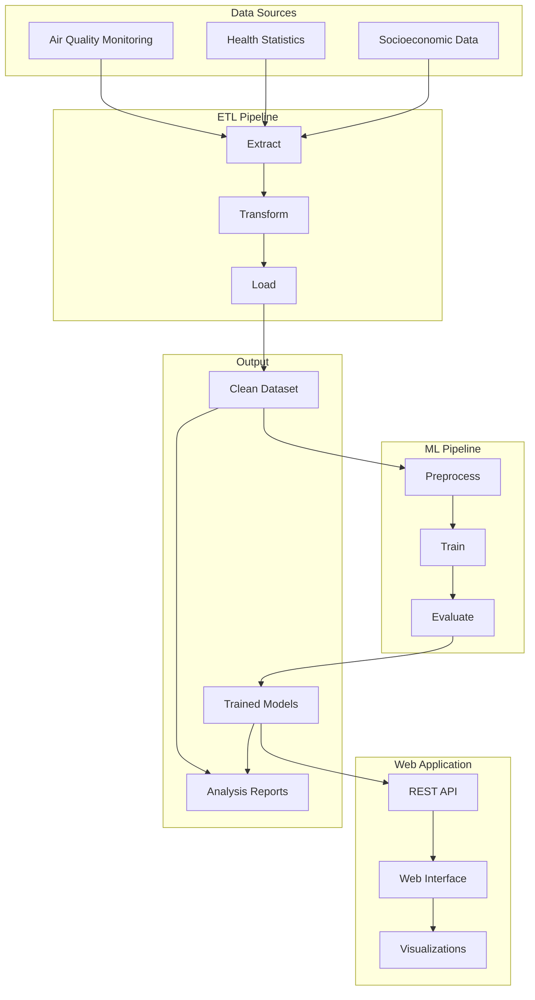

# TFM Air Quality Analysis Platform

Welcome to the comprehensive documentation for the **Air Quality Analysis Platform** - a complete end-to-end system for analyzing the relationships between air quality, health outcomes, and socioeconomic factors across Spanish provinces. This platform is developed as part of a master's thesis project.

## Project Overview

This platform provides a complete analytical pipeline for environmental health research, combining data engineering, machine learning, and web-based visualization to support evidence-based policy decisions and academic research.

### Research Objectives

- **Environmental Health Analysis**: Investigate correlations between air pollution and health outcomes
- **Regional Comparisons**: Compare environmental and health patterns across Spanish provinces
- **Predictive Modeling**: Develop ML models to predict health outcomes based on environmental factors
- **Policy Support**: Provide data-driven insights for environmental policy decisions

## Platform Architecture

The platform consists of three main components working together to provide a complete analytical solution:



## Core Components

### ETL Pipeline
**Purpose**: Data acquisition, cleaning, and integration

The ETL Pipeline processes raw data from multiple sources into a unified, analysis-ready dataset:

- **Data Sources**: Air quality monitoring stations, health statistics, socioeconomic indicators
- **Time Period**: 2000-2021 provincial data for Spain
- **Output**: Clean, integrated dataset with quality validation reports

**Key Features**:
- Automated data extraction from CSV sources
- Province name standardization and data integration
- Comprehensive data quality validation
- Error recovery and robust logging

[Learn more about the ETL Pipeline →](etl-pipeline/overview.md)

### ML Pipeline
**Purpose**: Model training, evaluation, and prediction

The ML Pipeline uses the clean dataset to train predictive models:

- **Framework**: DVC-managed pipeline for reproducibility
- **Models**: Multiple algorithms (linear regression, random forest, etc.)
- **Evaluation**: Comprehensive metrics and model comparison
- **Registry**: Model versioning and management system

**Key Features**:
- Configurable preprocessing and feature engineering
- Multiple model architectures with hyperparameter tuning
- Cross-validation and performance evaluation
- Model persistence and versioning

[Learn more about the ML Pipeline →](ml-pipeline/overview.md)

### Web Application
**Purpose**: Model serving and data visualization

The Web Application provides an interface for model predictions and data exploration:

- **Framework**: Flask-based REST API with web interface
- **Functionality**: Interactive predictions and data visualization
- **Integration**: Serves trained models from the ML pipeline

**Key Features**:
- RESTful API for model predictions
- Interactive web interface for data exploration
- Real-time visualization of analysis results
- Responsive design for multiple devices

[Learn more about the Web Application →](web-app/overview.md)

## Data Coverage

The platform analyzes data across multiple dimensions:

### Geographic Coverage
- **Scope**: All Spanish provinces (excluding islands and autonomous cities)
- **Resolution**: Provincial-level analysis
- **Standardization**: Unified province naming system

### Temporal Coverage
- **Period**: 2000-2021 (22 years of data)
- **Resolution**: Annual data points
- **Alignment**: Consistent temporal alignment across all data sources

### Data Domains

**Environmental Data**:
- Air pollutants: SO2, PM2.5, PM10, O3, NO2
- Monitoring station metadata and quality indicators
- Geographic coordinates and station characteristics

**Health Data**:
- Respiratory disease mortality rates
- Life expectancy statistics
- Provincial health outcome indicators

**Socioeconomic Data**:
- GDP per capita by province
- Population demographics
- Economic development indicators

## Getting Started

### Quick Start
Get the platform running in minutes:

```bash
# Clone the repository
git clone <repository-url>
cd tfm_air_quality

# Install dependencies
pip install -r requirements.txt

# Run the ETL pipeline
python src/etl_pipeline/main_orchestrator.py

# Run the ML pipeline
dvc repro

# Start the web application
python src/app/app.py
```

### Development Workflow

1. **Data Processing**: Use the ETL pipeline to process raw data
2. **Model Development**: Experiment with the ML pipeline for model training
3. **Application Testing**: Deploy the web application for result visualization
4. **Analysis**: Use the complete platform for research and analysis

## Use Cases

### Academic Research
- **Environmental Health Studies**: Correlate pollution with health outcomes
- **Regional Analysis**: Compare environmental health across provinces
- **Temporal Analysis**: Study long-term trends and patterns
- **Causal Inference**: Investigate relationships between variables

### Policy Applications
- **Impact Assessment**: Evaluate effectiveness of environmental policies
- **Resource Allocation**: Identify regions requiring intervention
- **Trend Monitoring**: Track environmental health improvements
- **Evidence-Based Policy**: Support decisions with data-driven insights

### Technical Applications
- **ML Research**: Experiment with environmental health prediction models
- **Data Engineering**: Learn ETL best practices with real-world data
- **Web Development**: Build analytical web applications
- **System Integration**: Understand end-to-end data platform architecture

## Technology Stack

**Data Processing**:
- Python with pandas, numpy for data manipulation
- YAML-based configuration management
- Comprehensive logging and error handling

**Machine Learning**:
- DVC for pipeline management and versioning
- scikit-learn for model implementation
- Configurable preprocessing and evaluation

**Web Application**:
- Flask for REST API and web interface
- Responsive HTML/CSS for user interface
- Integration with trained ML models

**Documentation**:
- MkDocs with Material theme
- Comprehensive API documentation
- Interactive diagrams and examples

## Project Structure

```
tfm_air_quality/
├── src/
│   ├── etl_pipeline/          # Data processing pipeline
│   ├── modeling/              # Machine learning pipeline  
│   ├── app/                   # Web application
│   └── common/                # Shared utilities
├── data/                      # Processed data and models
├── docs/                      # Documentation source
├── tests/                     # Test suites
├── dvc.yaml                   # ML pipeline definition
├── params.yaml                # ML configuration
└── requirements.txt           # Dependencies
```

## Next Steps

Explore the platform components in detail:

- **[Project Setup](getting-started/installation.md)**: Install and configure the platform
- **[ETL Pipeline](etl-pipeline/overview.md)**: Learn about data processing
- **[ML Pipeline](ml-pipeline/overview.md)**: Understand model training
- **[Web Application](web-app/overview.md)**: Explore the user interface
- **[System Architecture](architecture/platform-overview.md)**: Deep dive into system design

## Contributing

This platform is designed for extensibility and contributions:

- **New Data Sources**: Add additional environmental or health datasets
- **Model Improvements**: Implement new ML algorithms or features
- **Visualization Enhancements**: Expand web application functionality
- **Documentation**: Improve and expand platform documentation

See the [Development Guide](development/contributing.md) for contribution guidelines.

---

This platform represents a comprehensive approach to environmental health analysis, providing researchers and policymakers with powerful tools for data-driven decision making.