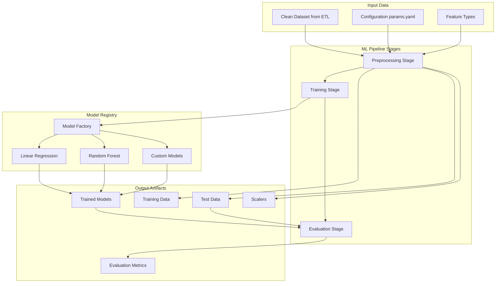

# ML Pipeline Overview

The Machine Learning Pipeline is a DVC-managed system that transforms the clean dataset from the ETL Pipeline into trained predictive models. This component implements a reproducible, version-controlled approach to model development and evaluation for environmental health analysis.

## Purpose and Scope

The ML Pipeline provides end-to-end machine learning capabilities for environmental health prediction:

- **Model Training**: Automated training of multiple ML algorithms
- **Model Evaluation**: Comprehensive performance assessment and comparison
- **Hyperparameter Tuning**: Systematic optimization of model parameters
- **Model Versioning**: Version control for models, data, and experiments
- **Reproducibility**: Ensure consistent results across different environments

## Architecture Overview



## Key Features

### DVC-Managed Pipeline
- **Reproducible Workflows**: Version-controlled pipeline stages
- **Dependency Tracking**: Automatic detection of data and code changes
- **Caching**: Intelligent caching of intermediate results
- **Experiment Tracking**: Compare different model configurations

### Flexible Model Architecture
- **Model Factory Pattern**: Extensible system for adding new algorithms
- **Configuration-Driven**: Model selection and hyperparameters via YAML
- **Multiple Algorithms**: Support for various ML approaches
- **Custom Models**: Easy integration of domain-specific models

### Comprehensive Evaluation
- **Multiple Metrics**: Accuracy, precision, recall, F1-score, R²
- **Cross-Validation**: Robust performance estimation
- **Model Comparison**: Side-by-side algorithm comparison
- **Feature Importance**: Understanding of model decisions

## Pipeline Stages

### 1. Preprocessing Stage

**File**: `src/modeling/preprocess.py`

**Purpose**: Prepare the raw dataset for machine learning

**Operations**:
- Feature selection based on configuration
- Categorical variable encoding
- Train/test split with stratification
- Data scaling and normalization
- Missing value handling

**Input**: 
- Clean dataset from ETL Pipeline (`src/etl_pipeline/data/output/dataset.csv`)
- Configuration parameters (`params.yaml`)

**Output**:
- Training dataset (`data/processed_training_data.csv`)
- Test dataset (`data/processed_test_data.csv`)
- Fitted scalers (`data/scalers/`)

### 2. Training Stage

**File**: `src/modeling/train.py`

**Purpose**: Train machine learning models using processed data

**Operations**:
- Model instantiation via factory pattern
- Hyperparameter configuration
- Model training with cross-validation
- Model persistence and serialization

**Input**:
- Training dataset
- Model configuration from `params.yaml`

**Output**:
- Trained model artifacts (`models/model.pkl`)
- Training metadata and logs

### 3. Evaluation Stage

**File**: `src/modeling/evaluate.py`

**Purpose**: Comprehensive model performance evaluation

**Operations**:
- Model loading and prediction
- Multiple evaluation metrics calculation
- Performance visualization (optional)
- Results comparison and reporting

**Input**:
- Trained models
- Test dataset
- Evaluation configuration

**Output**:
- Evaluation metrics (`metrics/evaluation.json`)
- Performance reports

## Configuration Management

The ML Pipeline is entirely configuration-driven through `params.yaml`:

```yaml
# Feature configuration
features:
  target_variable: &target_variable "respiratory_deaths_per_100k"
  numerical_features: &numerical_features
    - "Air Pollution Level"
    - "Life_expectancy_total"
    - "pib"
    - "Population"
  
  categorical_features: &categorical_features
    - "Province"
    - "Year"

# Model configuration
models:
  linear_regression:
    enabled: true
    hyperparameters:
      fit_intercept: true
      
  random_forest:
    enabled: true
    hyperparameters:
      n_estimators: 100
      max_depth: 10
      random_state: 42

# Training configuration
training:
  test_size: 0.2
  random_state: 42
  cross_validation:
    cv_folds: 5
    scoring: "r2"
```

### YAML Anchors and References

The configuration uses YAML anchors to avoid duplication:

```yaml
features:
  target_variable: &target_variable "respiratory_deaths_per_100k"
  
training:
  target: *target_variable  # References the anchor above
```

## Model Registry System

### Factory Pattern Implementation

The ML Pipeline uses a factory pattern for extensible model management:

```python
class ModelFactory:
    """Factory for creating and managing ML models"""
    
    @staticmethod
    def create_model(model_name: str, **hyperparameters):
        """Create model instance based on name and hyperparameters"""
        if model_name == "linear_regression":
            return LinearRegressionModel(**hyperparameters)
        elif model_name == "random_forest":
            return RandomForestModel(**hyperparameters)
        # Easy to add new models
```

### Base Model Class

All models inherit from a common base class:

```python
class BaseModel(ABC):
    """Abstract base class for ML models"""
    
    @abstractmethod
    def train(self, X, y) -> None:
        """Train the model"""
        pass
    
    @abstractmethod
    def predict(self, X) -> np.ndarray:
        """Make predictions"""
        pass
    
    @abstractmethod
    def get_feature_importance(self) -> Dict[str, float]:
        """Get feature importance scores"""
        pass
```

### Supported Models

**Linear Regression**:
- Simple baseline model
- Good for understanding linear relationships
- Fast training and prediction
- Interpretable coefficients

**Random Forest**:
- Ensemble method for complex patterns
- Handles non-linear relationships
- Built-in feature importance
- Robust to outliers

**Extensible for**:
- Gradient boosting models (XGBoost, LightGBM)
- Neural networks
- Support Vector Machines
- Domain-specific models

## Data Processing Features

### Feature Engineering

The preprocessing stage handles various data transformations:

```yaml
preprocessing:
  feature_engineering:
    create_interaction_features: false
    polynomial_features: false
    log_transform: []
    
  scaling:
    method: "standard"  # standard, minmax, robust
    
  categorical_encoding:
    method: "onehot"    # onehot, label, target
```

### Missing Value Handling

```yaml
preprocessing:
  missing_values:
    strategy: "mean"     # mean, median, mode, drop
    threshold: 0.1       # Drop columns with >10% missing
```

### Feature Selection

```yaml
feature_selection:
  enabled: true
  method: "variance_threshold"  # variance_threshold, univariate, recursive
  parameters:
    threshold: 0.01
```

## Evaluation Framework

### Metrics Calculation

The evaluation stage calculates multiple metrics:

```python
# Regression metrics
metrics = {
    "r2_score": r2_score(y_true, y_pred),
    "mean_absolute_error": mean_absolute_error(y_true, y_pred),
    "mean_squared_error": mean_squared_error(y_true, y_pred),
    "root_mean_squared_error": np.sqrt(mean_squared_error(y_true, y_pred))
}
```

### Cross-Validation

```yaml
evaluation:
  cross_validation:
    enabled: true
    cv_folds: 5
    scoring: ["r2", "neg_mean_absolute_error"]
    
  test_evaluation:
    enabled: true
    metrics: ["r2", "mae", "mse", "rmse"]
```

### Model Comparison

The evaluation system compares multiple models:

```json
{
  "model_comparison": {
    "linear_regression": {
      "r2_score": 0.75,
      "mae": 2.34,
      "training_time": 0.12
    },
    "random_forest": {
      "r2_score": 0.82,
      "mae": 2.01,
      "training_time": 1.45
    }
  }
}
```

## DVC Integration

### Pipeline Definition

The pipeline is defined in `dvc.yaml`:

```yaml
stages:
  preprocess:
    cmd: python src/modeling/preprocess.py params.yaml src/etl_pipeline/data/output/dataset.csv data/processed_training_data.csv data/processed_test_data.csv
    deps:
      - src/modeling/preprocess.py
      - params.yaml
      - src/etl_pipeline/data/output/dataset.csv
    outs:
      - data/processed_training_data.csv
      - data/processed_test_data.csv
      
  train:
    cmd: python src/modeling/train.py params.yaml data/processed_training_data.csv models/model.pkl
    deps:
      - src/modeling/train.py
      - params.yaml
      - data/processed_training_data.csv
    outs:
      - models/model.pkl
      
  evaluate:
    cmd: python src/modeling/evaluate.py params.yaml models/model.pkl data/processed_test_data.csv metrics/evaluation.json
    deps:
      - src/modeling/evaluate.py
      - params.yaml
      - models/model.pkl
      - data/processed_test_data.csv
    metrics:
      - metrics/evaluation.json
```

### Pipeline Execution

```bash
# Run complete pipeline
dvc repro

# Run specific stage
dvc repro train

# Force re-run (ignore cache)
dvc repro --force
```

### Experiment Tracking

```bash
# Compare experiments
dvc metrics show
dvc metrics diff

# Show pipeline status
dvc status

# Show data lineage
dvc dag
```

## Integration Points

### Upstream Dependencies
- **ETL Pipeline**: Provides clean, integrated dataset
- **Configuration**: `params.yaml` for all ML parameters
- **Feature Types**: Column data types from ETL configuration

### Downstream Consumers
- **Web Application**: Loads trained models for predictions
- **Analysis Notebooks**: Uses trained models for research
- **Model Deployment**: Serves models in production environments

## Performance Characteristics

### Training Performance
- **Linear Regression**: <1 second for typical datasets
- **Random Forest**: 1-5 seconds depending on hyperparameters
- **Memory Usage**: Scales with dataset size and model complexity

### Prediction Performance
- **Batch Predictions**: Optimized for processing multiple samples
- **Single Predictions**: Fast inference for web application
- **Model Loading**: Efficient pickle-based serialization

## Usage Examples

### Running the Complete Pipeline

```bash
# Execute all stages
dvc repro

# Check results
cat metrics/evaluation.json
```

### Individual Stage Execution

```bash
# Preprocessing only
python src/modeling/preprocess.py params.yaml src/etl_pipeline/data/output/dataset.csv data/processed_training_data.csv data/processed_test_data.csv

# Training only
python src/modeling/train.py params.yaml data/processed_training_data.csv models/model.pkl

# Evaluation only
python src/modeling/evaluate.py params.yaml models/model.pkl data/processed_test_data.csv metrics/evaluation.json
```

### Configuration Experiments

```bash
# Modify params.yaml for different experiment
# Then run pipeline
dvc repro

# Compare with previous experiment
dvc metrics diff
```

## Next Steps

- **[Model Training](training.md)**: Detailed guide to training models
- **[Model Evaluation](evaluation.md)**: Understanding evaluation metrics and comparison
- **[Model Registry](registry.md)**: Managing and versioning models
- **[Web Application Integration](../web-app/overview.md)**: Using trained models for predictions

The ML Pipeline provides a robust, reproducible foundation for environmental health prediction modeling, ensuring that models are properly trained, evaluated, and versioned for reliable deployment and analysis.