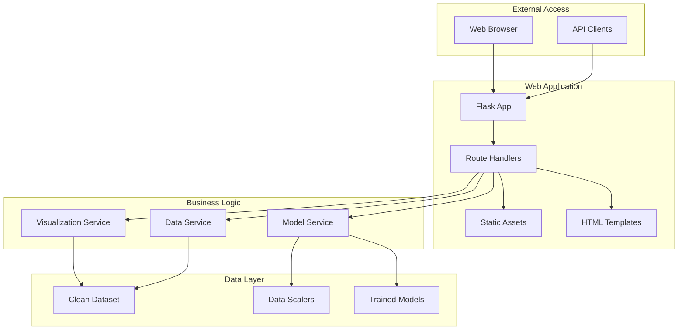

# Web Application Overview

The Web Application provides an interactive interface for accessing trained machine learning models and exploring the environmental health dataset. Built with Flask, it serves as the user-facing component of the Air Quality Analysis Platform, enabling real-time predictions and data visualization.

## Purpose and Scope

The Web Application bridges the gap between complex data science workflows and end-user accessibility:

- **Model Serving**: Deploy trained ML models for real-time predictions
- **Data Exploration**: Interactive interface for dataset exploration
- **Visualization**: Charts and graphs for data analysis
- **API Access**: RESTful endpoints for programmatic access
- **User Interface**: Intuitive web interface for non-technical users

## Architecture Overview



## Key Features

### Interactive Predictions
- **Real-time Inference**: Instant predictions using trained models
- **Input Validation**: Ensures data quality for reliable predictions
- **Multiple Models**: Compare predictions across different algorithms
- **Confidence Intervals**: Uncertainty quantification for predictions

### Data Exploration
- **Dataset Browser**: Explore the integrated dataset
- **Filtering and Search**: Find specific data points or trends
- **Summary Statistics**: Descriptive statistics for all variables
- **Data Quality Metrics**: Information about data completeness and quality

### Visualization Dashboard
- **Time Series Plots**: Trends over time for different provinces
- **Correlation Analysis**: Relationships between variables
- **Geographic Visualization**: Provincial comparisons and patterns
- **Model Performance**: Evaluation metrics and comparisons

### RESTful API
- **Prediction Endpoints**: Programmatic access to ML models
- **Data Access**: Retrieve dataset information via API
- **Status Monitoring**: Health checks and system status
- **Documentation**: Interactive API documentation

## Application Structure

### Flask Application (`src/app/app.py`)

The main application file configures and runs the Flask server:

```python
from flask import Flask, render_template, request, jsonify
from services.model_service import ModelService

app = Flask(__name__)
model_service = ModelService()

@app.route('/')
def index():
    """Main dashboard page"""
    return render_template('index.html')

@app.route('/api/predict', methods=['POST'])
def predict():
    """Prediction API endpoint"""
    data = request.get_json()
    prediction = model_service.predict(data)
    return jsonify(prediction)
```

### Service Layer

#### Model Service (`src/app/services/model_service.py`)

Handles model loading and prediction logic:

```python
class ModelService:
    """Service for ML model operations"""
    
    def __init__(self):
        self.models = self._load_models()
        self.scalers = self._load_scalers()
    
    def predict(self, input_data: Dict) -> Dict:
        """Generate predictions for input data"""
        # Validate input
        # Scale features
        # Make prediction
        # Return results with confidence
```

#### Data Service

Manages dataset access and exploration:

```python
class DataService:
    """Service for dataset operations"""
    
    def get_dataset_summary(self) -> Dict:
        """Return dataset summary statistics"""
        
    def filter_data(self, filters: Dict) -> pd.DataFrame:
        """Filter dataset based on criteria"""
        
    def get_province_data(self, province: str) -> Dict:
        """Get all data for specific province"""
```

### Web Interface

#### Main Dashboard (`src/app/templates/index.html`)

The primary user interface provides:

- **Prediction Form**: Input fields for making predictions
- **Results Display**: Show prediction results and confidence
- **Data Overview**: Summary statistics and data quality info
- **Navigation**: Access to different application features

#### Template Structure

```html
<!DOCTYPE html>
<html lang="en">
<head>
    <title>Air Quality Analysis Platform</title>
    <link rel="stylesheet" href="{{ url_for('static', filename='css/style.css') }}">
</head>
<body>
    <nav class="navbar">
        <h1>Air Quality Analysis</h1>
    </nav>
    
    <main class="container">
        <section id="prediction-form">
            <!-- Prediction input form -->
        </section>
        
        <section id="results">
            <!-- Prediction results -->
        </section>
        
        <section id="data-explorer">
            <!-- Data exploration interface -->
        </section>
    </main>
    
    <script src="{{ url_for('static', filename='js/app.js') }}"></script>
</body>
</html>
```

## API Endpoints

### Prediction API

**POST `/api/predict`**

Generate predictions using trained models.

```json
// Request
{
    "province": "Madrid",
    "year": 2020,
    "air_pollution_level": 35.5,
    "life_expectancy": 82.1,
    "gdp_per_capita": 25000,
    "population": 6500000
}

// Response
{
    "prediction": {
        "respiratory_deaths_per_100k": 15.2,
        "confidence_interval": [12.1, 18.3],
        "model_used": "random_forest"
    },
    "input_validation": {
        "valid": true,
        "warnings": []
    },
    "model_info": {
        "name": "Random Forest",
        "version": "1.0",
        "accuracy": 0.82
    }
}
```

### Data API

**GET `/api/data/summary`**

Get dataset summary statistics.

```json
{
    "total_records": 15420,
    "date_range": {
        "start": "2000",
        "end": "2021"
    },
    "provinces": 47,
    "data_completeness": {
        "air_pollution_level": 0.85,
        "respiratory_diseases": 0.92,
        "life_expectancy": 0.98
    }
}
```

**GET `/api/data/provinces`**

List all provinces in the dataset.

**GET `/api/data/province/{province_name}`**

Get all data for a specific province.

### Model API

**GET `/api/models/info`**

Get information about available models.

```json
{
    "available_models": [
        {
            "name": "linear_regression",
            "display_name": "Linear Regression",
            "accuracy": 0.75,
            "training_date": "2024-01-15"
        },
        {
            "name": "random_forest",
            "display_name": "Random Forest",
            "accuracy": 0.82,
            "training_date": "2024-01-15"
        }
    ],
    "default_model": "random_forest"
}
```

## User Interface Features

### Prediction Interface

**Input Form**:
- Province selection dropdown
- Year input (2000-2021)
- Air pollution level input with validation
- Socioeconomic indicators (GDP, population)
- Health baseline data (life expectancy)

**Results Display**:
- Primary prediction with confidence interval
- Model comparison (if multiple models available)
- Feature importance visualization
- Historical context for the province

### Data Explorer

**Dataset Browser**:
- Sortable and filterable data table
- Search functionality across all columns
- Export capabilities (CSV, JSON)
- Pagination for large datasets

**Visualization Dashboard**:
- Time series plots for trends
- Scatter plots for correlations
- Provincial comparison charts
- Interactive maps (if geographic data available)

### Model Performance Dashboard

**Evaluation Metrics**:
- Model accuracy and error metrics
- Feature importance rankings
- Cross-validation results
- Model comparison tables

**Performance Visualization**:
- Prediction vs. actual scatter plots
- Residual analysis
- Learning curves
- Error distribution plots

## Configuration and Deployment

### Application Configuration

```python
# src/app/config.py
class Config:
    """Application configuration"""
    
    # Model paths
    MODEL_PATH = "models/"
    SCALER_PATH = "data/scalers/"
    DATASET_PATH = "src/etl_pipeline/data/output/dataset.csv"
    
    # API settings
    API_RATE_LIMIT = "100 per hour"
    DEBUG = False
    
    # UI settings
    PAGE_SIZE = 50
    MAX_PROVINCES_DISPLAY = 10
```

### Development Server

```bash
# Run development server
python src/app/app.py

# Server starts on http://localhost:5000
```

### Production Deployment

```bash
# Using Gunicorn
pip install gunicorn
gunicorn -w 4 -b 0.0.0.0:8000 src.app.app:app

# Using Docker
docker build -t air-quality-app .
docker run -p 8000:8000 air-quality-app
```

## Integration with ML Pipeline

### Model Loading

The web application automatically loads trained models from the ML pipeline:

```python
class ModelService:
    def _load_models(self) -> Dict:
        """Load all available trained models"""
        models = {}
        model_path = Path("models/")
        
        for model_file in model_path.glob("*.pkl"):
            model_name = model_file.stem
            models[model_name] = joblib.load(model_file)
            
        return models
```

### Data Integration

Direct access to the clean dataset from the ETL pipeline:

```python
class DataService:
    def __init__(self):
        self.dataset = pd.read_csv("src/etl_pipeline/data/output/dataset.csv")
        self._validate_dataset()
```

### Real-time Updates

The application can detect when new models or data are available:

```python
def check_for_updates(self):
    """Check if models or data have been updated"""
    # Check file modification times
    # Reload models if necessary
    # Update data cache
```

## Security and Validation

### Input Validation

```python
def validate_prediction_input(data: Dict) -> Tuple[bool, List[str]]:
    """Validate prediction input data"""
    errors = []
    
    # Check required fields
    required_fields = ["province", "year", "air_pollution_level"]
    for field in required_fields:
        if field not in data:
            errors.append(f"Missing required field: {field}")
    
    # Validate ranges
    if "year" in data and not (2000 <= data["year"] <= 2021):
        errors.append("Year must be between 2000 and 2021")
    
    return len(errors) == 0, errors
```

### Rate Limiting

```python
from flask_limiter import Limiter
from flask_limiter.util import get_remote_address

limiter = Limiter(
    app,
    key_func=get_remote_address,
    default_limits=["100 per hour"]
)

@app.route('/api/predict', methods=['POST'])
@limiter.limit("10 per minute")
def predict():
    # Prediction logic
```

## Performance Optimization

### Caching

```python
from flask_caching import Cache

cache = Cache(app, config={'CACHE_TYPE': 'simple'})

@app.route('/api/data/summary')
@cache.cached(timeout=300)  # Cache for 5 minutes
def data_summary():
    # Expensive computation
```

### Async Processing

For computationally expensive operations:

```python
from celery import Celery

celery = Celery(app.name, broker='redis://localhost:6379')

@celery.task
def batch_prediction(data_batch):
    """Process large batch predictions asynchronously"""
    # Handle large prediction requests
```

## Next Steps

- **[API Documentation](api.md)**: Detailed API reference and examples
- **[Deployment Guide](deployment.md)**: Production deployment instructions
- **[Integration](../development/contributing.md)**: Extend the web application functionality

The Web Application provides an intuitive, accessible interface to the complex environmental health analysis capabilities, making the platform's insights available to researchers, policymakers, and other stakeholders without requiring technical expertise.